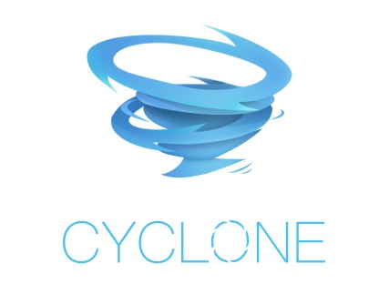
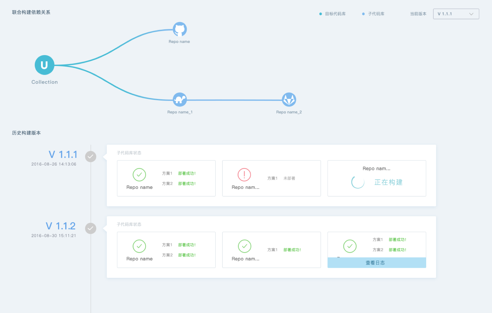
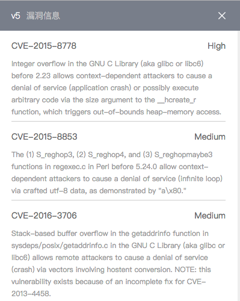

English | [中文](README_zh-CN.md)
# Cyclone

Cyclone is a cloud native CI/CD platform built for container workflow.

The primary directive of cyclone is to ship code from local development all the way to container engine of choice, either running in test or production environment. Features of cyclone includes:

- **Container Native**: every build, integration and deployment runs in container, completely excludes inconsistency between runtime environment

- **Dependency Aware**: define dependency rules, or simply component relationship, cyclone takes care of execution order as well as rollout strategy

- **Version Control**: cyclone is built with version control in mind; retrieving image/pipeline history is as simple as querying its version management interface

- **Two-way Binding**: cyclone records every CI/CD operation and its effect to answer questions like "how various container images are deployed across the fleet?"

- **Security First**: security is an essential part of cyclone; barriers can be setup to prevent insecure images from launching into production

## Documentation
* [Setup Guide](./docs/setup.md)
* [Quick Start](./docs/quick-start.md)
* [caicloud.yml Introduction](./docs/caicloud-yml-introduction.md)
* [API Guide](http://118.193.142.27:7099/apidocs/)
* [Principle](./docs/principle.md)
