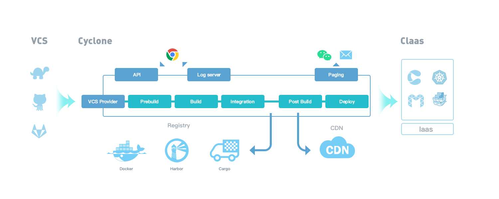

## Workflow

- Cyclone provides abundant [API](http://118.193.142.27:7099/apidocs/) for web applications.
- After relating the code repository in VCS with the service of Cyclone via API, commiting and releasing to VCS will notify Cyclone-Server by webhook
- Cyclone-Server will run a Cyclone-Worker container which base the tech of Docker-in-Docker, the container will checkout code from VCS, then execute steps according to configrations of caicloud.yml in the code repository as followed: 
  - PreBuild: compile executable file in the specified system environment
  - Build: copy the executable file to the specified system environment, packet the environment to a image and push the image to registry
  - PostBuild：run a container to execute some shells or commads which aims to do some related operations after the images published
  - Integretion: use the image built durning the build step to run a container , run the micro service containers which depend by CI, run the integretion testing
  - Deploy: use the published image to run a application in to containers cluster Platform such as kubernetes
- The process log can be pulled from Cyclone-Server via websocket
- Cyclone-Server will send the result and log of CI & CD to user by email when the progress has finished

## Architecture

Each cube represent a container
- The Api-Server component in Cyclone-Server provides the restful API service, if the task created by calling the API needs long time to handle, it will generate a pending event and write into etcd
- The EventManger component load pending events from etcd, watch the change of events, and send new pending event to WorkerManager
- WorkerManager call the docker API to run a Cyclone-Worker container, and send information to it via ENVs
- Cyclone-Worker use event ID as a token to call API and get event information, then run containers to execute integretion, prebuild, build and post build steps, progress log push to Log-Server and save to kafka
- Log-Server component pull log from kafka and push it to user
- The date need to be persisted save into mongo
