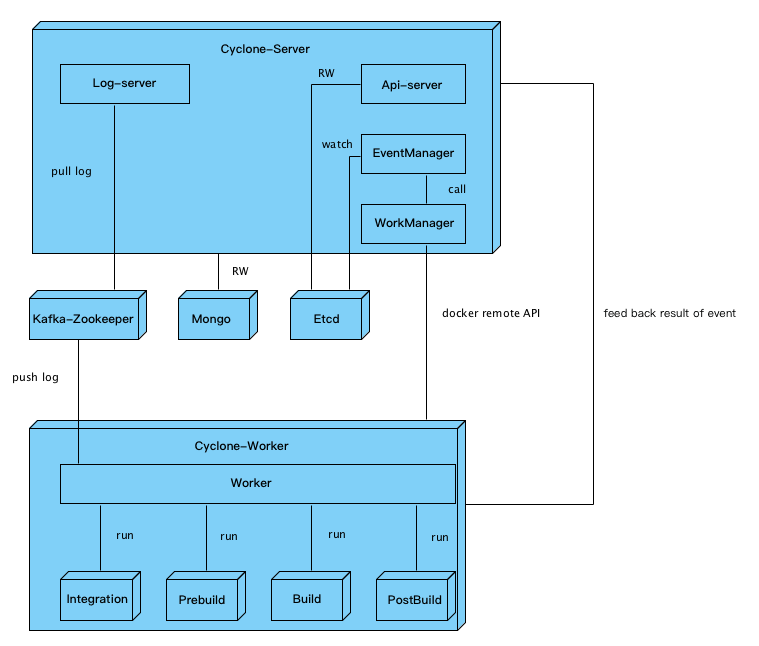

# 工作流

- Circle提供了丰富的[API](http://118.193.142.27:7099/apidocs/)供web应用调用（详见API说明）
- 通过API建立版本控制系统中代码库与Circle服务关联关系后，版本控制系统的提交、发布等动作会通过webhook通知到Circle-Server
- Circle-Server启动一个基于Docker in Docker技术的Circle-Worker容器，在该容器中从代码库中拉取源码，按照源码中caicloud.yml配置文件，依次执行：
  - PreBuild：在指定编译环境中编译可执行文件
  - Build：将可执行文件拷到运行环境容器中，打成镜像发布到镜像仓库中
  - Integretion：使用Build阶段构建的镜像启动一个容器，启动持续集成所依赖的微服务容器进行集成测试
  - PostBuild：启动一个容器执行一些脚本命令，实现镜像发布后的一些关联操作
  - Deploy：使用发布的镜像部署应用到kubernetes等容器集群Paas平台
- 构建过程日志可以通过Websocket从Circle-Server拉取
- 构建结束后Circle-Server将构建结果和完整构建日志通过邮件通知用户

# 软件架构

每个立方体代表一个容器
- Circle-Server中Api-Server组件提供Restful API服务，被调用后需要较长时间处理的任务生成一个待处理事件写入etcd
- EventManager加载etcd中未完成事件，监视事件变化，发送新增待处理事件到WorkerManager中
- WorkerManager调用Docker API启一个Circle－Worker容器，通过环境变量传入需要处理的事件ID等信息
- Circle-Worker使用事件ID作为token（有效期2小时）调用API，拉取事件信息依次启容器执行integration、prebuild、build、post build，完成后反馈事件执行结果，构建过程日志推送到Log-Server，转存到Kafka
- Log-Server组件从Kafka拉取日志推送给用户
- 需要持久化的数据存入mongo
